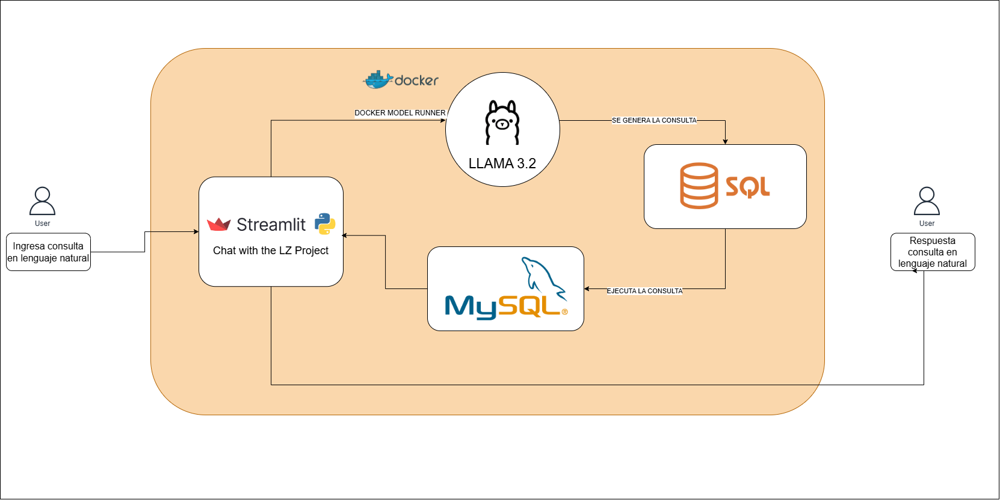
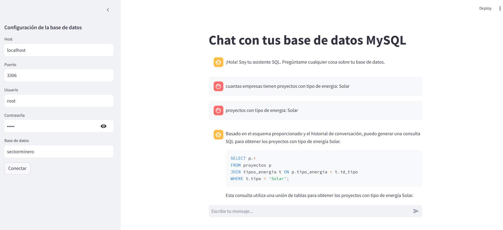

# Chatbot para consultas SQL con integración de Llama 3.2 y MySQL

Bienvenido a **Chat with MySQL**, un chatbot interactivo basado en Streamlit que utiliza Llama 3.2 (vía Docker Model Runner) y una clase auxiliar personalizada para generar y ejecutar consultas SQL a partir de lenguaje natural. Este proyecto está diseñado para facilitar la interacción con grandes conjuntos de datos usando un lenguaje simple y comprensible.

---

## Características

- **Interacción en Lenguaje Natural:** Escribe tus consultas en lenguaje cotidiano y obtén respuestas basadas en SQL.
- **Generación Dinámica de Consultas SQL:** Llama 3.2 interpreta la intención del usuario y genera consultas SQL precisas.
- **Integración con Bases de Datos:** Se conecta a una base de datos MySQL para recuperar y mostrar resultados.
- **Interfaz Gráfica con Streamlit:** Una interfaz amigable que facilita la interacción tanto con Llama 3.2 como con la base de datos.
- **Visualización Automática:** Los resultados pueden visualizarse como tablas y gráficos (líneas, barras) según el tipo de datos.
- **Conocimiento del Esquema:** Recupera y muestra dinámicamente los esquemas de tablas para mejorar la precisión de las consultas.

---

## Arquitectura



1. **Entrada del Usuario:** Consulta en lenguaje natural a través de la interfaz de Streamlit.
2. **Recuperación del Esquema:** Obtiene dinámicamente detalles de los esquemas de tablas.
3. **Generación de Consultas:** Llama 3.2 (vía Docker Model Runner) interpreta la entrada y genera la consulta SQL.
4. **Ejecución en la Base de Datos:** Las consultas se ejecutan en MySQL mediante una clase auxiliar personalizada.
5. **Visualización de Resultados:** Los resultados se muestran como DataFrame y gráficos en la GUI.

### Ejemplo de funcionamiento



---

## Instalación

### 1. Clonar el proyecto

```sh
git clone https://github.com/LeoR22/ai_chatbot_mysql.git
cd ai_chatbot_mysql
```

### 2. Crear y activar entorno virtual

```sh
python3 -m venv venv
# Linux/MacOS
source venv/bin/activate
# Windows
venv\Scripts\activate
```

### 3. Instalar dependencias

```sh
pip install -r requirements.txt
```

### 4. Configurar y ejecutar Llama 3.2 con Docker Model Runner

Debes tener Docker instalado. Ejecuta el modelo Llama 3.2 usando Model Runner:

```sh
docker run -it --rm -p 12434:12434 ghcr.io/huggingface/model-runner:latest \
  --model-id meta-llama/Meta-Llama-3-8B-Instruct \
  --port 12434
```

Esto expondrá la API en `http://localhost:12434/engines/llama.cpp/v1/chat/completions`, que es la URL utilizada en [`src/app.py`](src/app.py).

---

## Uso

### 1. Ejecutar la aplicación de Streamlit

```sh
streamlit run src/app.py
```

### 2. Configurar conexión a MySQL

En la barra lateral, ingresa los datos de tu base de datos MySQL y haz clic en **Conectar**.

### 3. Interactuar con el Chatbot

Escribe consultas en lenguaje natural, por ejemplo:

- **"Muestra los registros de la tabla usuarios."**
- **"¿Cuál es el esquema de la tabla ventas?"**
- **"Obtén el promedio de usuarios en los últimos tres meses."**

El chatbot generará la consulta SQL, la ejecutará y mostrará los resultados en tabla y gráficos si corresponde.

---

## Estructura del proyecto

```plaintext
ai_chatbot_mysql/
│
├── docs/
│   ├── chatbot_mysql.png
│   ├── chatbot.png
├── src/
│   ├── app.py
│   └── __pycache__/
├── .gitignore
├── Readme.md
└── requirements.txt
```

---

## Bibliotecas y Herramientas Clave

- **Python 3.9+**
- **Streamlit:** GUI interactiva para consultas y visualización de resultados.
- **Llama 3.2:** Motor de comprensión del lenguaje natural (vía Docker Model Runner).
- **Pandas:** Procesamiento y formato de datos.
- **MySQL Connector:** Conexión y ejecución de consultas en MySQL.
- **Requests:** Comunicación con la API de Llama.
- **LangChain:** Manejo de mensajes de chat.

---

## Referencias

- [Documentación Docker Model Runner](https://docs.docker.com/ai/model-runner/)
- [Streamlit](https://streamlit.io/)
- [Meta Llama 3](https://ai.meta.com/llama/)
- [LangChain](https://python.langchain.com/)

---

## Contribuciones

¿Quieres contribuir? ¡Sigue estos pasos!

1. Haz un fork del repositorio.
2. Crea una nueva rama (`git checkout -b feature-nueva-funcionalidad`).
3. Realiza tus cambios y haz commit (`git commit -m 'Agrega nueva funcionalidad'`).
4. Sube los cambios a la rama (`git push origin feature-nueva-funcionalidad`).
5. Abre un Pull Request.

---

## Licencia

Este proyecto está licenciado bajo la Licencia MIT. Consulta el archivo LICENSE para más detalles.

---

## Contacto

Leandro Rivera: <leo.232rivera@gmail.com>

---

### ¡Feliz Codificación! 🚀  

Si encuentras útil este proyecto, ¡dale una ⭐ en GitHub! 😊
